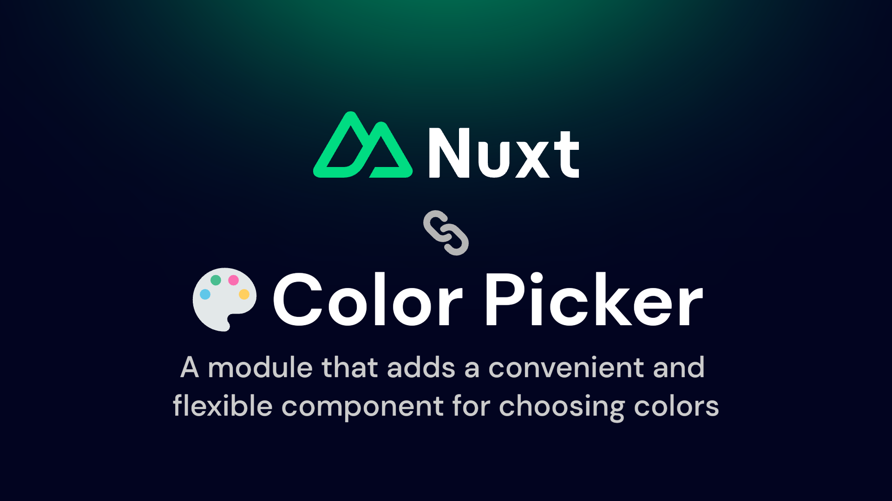

[](./docs/poster.png)

[![npm version][npm-version-src]][npm-version-href]
[![npm downloads][npm-downloads-src]][npm-downloads-href]
[![License][license-src]][license-href]
[![Nuxt][nuxt-src]][nuxt-href]

# Nuxt Color Picker

A module that adds a convenient, customizable ColorPicker component to select colors in your application.

> This module works with Nuxt 3 only

## Features

- Easy connection
- Customization of component colors
- Two use cases (as color-picker and as color-picker-block)
- EyeDropper support
- Color selection history
- Initial color display
- Alpha range availability

## Usage

Install the module:

```sh
npm install nuxt-color-picker
```

## Configuration

```ts
export default defineNuxtConfig({
  modules: ["nuxt-color-picker"]
})
```

## Development

- Run `npm run dev:prepare` to generate type stubs.
- Use `npm run dev` to start playground in development mode.

## Deploy


Deploy the application on the Edge with [NuxtHub](https://hub.nuxt.com) on your Cloudflare account:

```bash
npm run deploy
```

Then checkout your server logs, analaytics and more in the [NuxtHub Admin](https://admin.hub.nuxt.com).

You can also deploy using [Cloudflare Pages CI](https://hub.nuxt.com/docs/getting-started/deploy#cloudflare-pages-ci).

## License

[MIT License](./LICENSE)

<!-- Badges -->

[npm-version-src]: https://img.shields.io/npm/v/nuxt-color-picker/latest.svg
[npm-version-href]: https://npmjs.com/package/nuxt-color-picker
[npm-downloads-src]: https://img.shields.io/npm/dt/nuxt-color-picker.svg
[npm-downloads-href]: https://npmjs.com/package/nuxt-color-picker
[license-src]: https://img.shields.io/npm/l/nuxt-color-picker.svg
[license-href]: https://npmjs.com/package/nuxt-color-picker
[nuxt-src]: https://img.shields.io/badge/Nuxt-18181B?logo=nuxt.js
[nuxt-href]: https://nuxt.com
